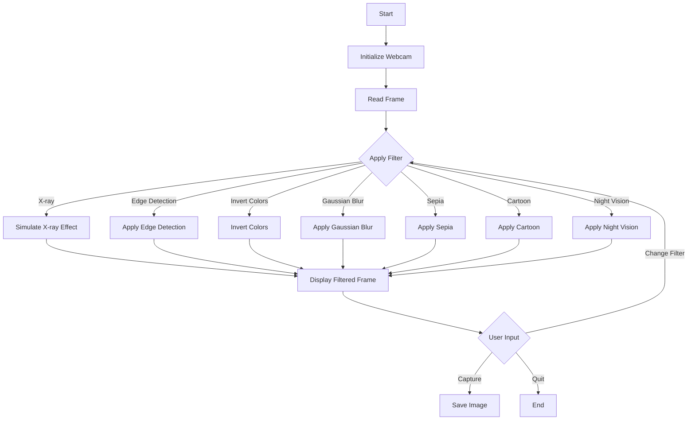

# 🖼️ FilterX - The Visionary Lens

 

FilterX is an innovative webcam application designed to enhance your video feed with a variety of artistic filters. With options like **X-ray**, **sepia**, **cartoon**, and **night vision**, FilterX allows you to capture stunning images and explore vibrant colors in real-time. This application transforms every moment into a unique visual experience, redefining creativity and expression in a fun and engaging way.

---

## 🎨 Features


- **Artistic Filters**: Choose from a wide range of filters, including:
  - X-ray
  - Sepia
  - Cartoon
  - Night Vision
  - Edge Detection
  - Invert Colors
  - And many more!
  
- **Real-time Processing**: Experience effects applied instantly to your webcam feed.

- **Image Capture**: Save your filtered images directly to your device.

- **Intuitive Controls**: Easy-to-use keyboard shortcuts for seamless interaction.

- **Customizable Thresholds**: Adjust the threshold for effects like the X-ray filter for personalized results.

- **User-Friendly Interface**: Simple and clear design to enhance usability.

---

## 📦 Installation

### Prerequisites

Ensure you have the following installed:

- Python 3.x
- OpenCV
- NumPy

### Steps to Install

1. **Clone the repository**:
   ```bash
   git clone https://github.com/rubydamodar/FilterX-The-Visionary-Lens.git
   ```

2. **Navigate to the project directory**:
   ```bash
   cd FilterX-The-Visionary-Lens
   ```

3. **Install the required packages**:
   ```bash
   pip install opencv-python numpy
   ```

4. **Run the application**:
   ```bash
   python filterchanger.py
   ```

---

## 📖 Usage

Once the application is running, you can interact with it using the following keyboard shortcuts:

| Key  | Action                                       |
|------|----------------------------------------------|
| `c`  | Capture the current frame as an image.      |
| `UP` | Increase the threshold for the X-ray effect.|
| `DOWN` | Decrease the threshold for the X-ray effect. |
| `f`  | Change the current filter.                   |
| `q`  | Quit the application.                        |

### Flowchart of Functionality



---

## 📜 License

This project is licensed under the [MIT License](LICENSE). Feel free to modify and distribute it, but please keep the license intact.

---

## 🙏 Acknowledgments

- **OpenCV**: For providing powerful tools for image processing.
- **NumPy**: For enabling efficient numerical computations.
- **Mermaid**: For allowing us to create flowcharts easily.

---

## 🌟 Contributing

Contributions are welcome! If you have suggestions or improvements, please create a pull request or open an issue.

---

## 📞 Contact

For questions or feedback, please contact [Ruby Poddar](mailto:rubypoddarr@gmail.com).

